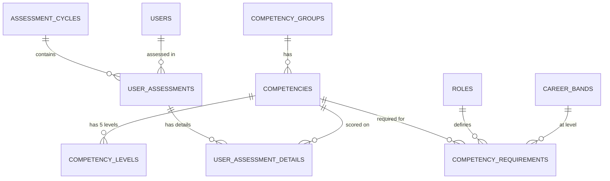
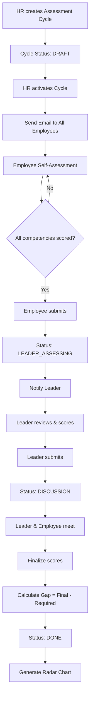
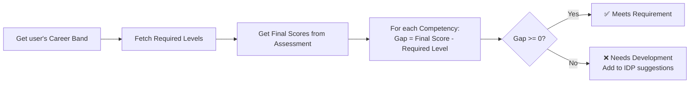
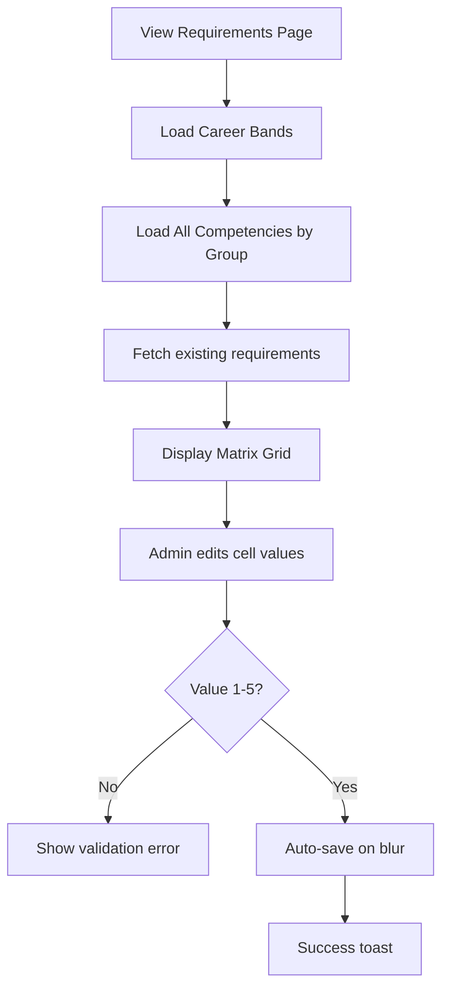

# Feature Specification: Competency Management System

## 1. Executive Summary

Hệ thống **Quản lý Năng lực (Competency Management)** cho phép Admin/HR định nghĩa khung năng lực công ty, thiết lập yêu cầu theo từng cấp bậc nghề nghiệp, và đánh giá nhân viên thông qua các chu kỳ định kỳ. Hệ thống cung cấp **Gap Analysis** và **Radar Charts** để trực quan hóa mức độ đáp ứng yêu cầu của từng nhân viên.

**Key Features:**

- ✅ **Competency Dictionary** - CRUD cho Groups, Competencies, Behavioral Levels
- ✅ **Competency Requirements Matrix** - Định nghĩa yêu cầu theo Role + Career Band
- ✅ **Assessment Cycles** - Chu kỳ đánh giá định kỳ (Q1, Q2, Mid-Year, Year-End)
- ✅ **Self & Leader Assessment** - Quy trình tự đánh giá → Leader đánh giá → Discussion
- ✅ **Gap Analysis** - So sánh điểm thực tế vs yêu cầu, tính Gap
- ✅ **Radar Chart** - Trực quan hóa năng lực theo nhóm
- ✅ **IDP Integration** - Đề xuất kế hoạch phát triển cá nhân dựa trên Gap

---

## 2. User Stories

### Admin / HR

**US-1: Quản lý Nhóm Năng lực**

- As an Admin/HR, I want to create/edit/delete competency groups (Core, Technical, Leadership), so I can organize competencies logically.
- **AC:**
  - Group name is required and unique
  - Can reorder groups for display priority
  - Deleting group requires moving/deleting child competencies first

**US-2: Quản lý Năng lực**

- As an Admin/HR, I want to define competencies with name, description, and 5 behavioral levels.
- **AC:**
  - Each competency belongs to exactly one group
  - Each competency has 5 levels (1-5) with behavioral indicators
  - Can search/filter competencies by group

**US-3: Thiết lập Ma trận Yêu cầu**

- As an Admin/HR, I want to set required competency levels for each Career Band.
- **AC:**
  - Matrix view: Rows = Competencies, Columns = Career Bands
  - Bulk update support
  - Show warning if requirement > 5 or < 1

**US-4: Quản lý Chu kỳ Đánh giá**

- As an Admin/HR, I want to create assessment cycles with start/end dates.
- **AC:**
  - Only one cycle can be ACTIVE at a time
  - Can assign cycle to specific teams or all employees
  - Status flow: DRAFT → ACTIVE → COMPLETED
  - Send email notifications when cycle starts

**US-5: Xem Báo cáo Tổng hợp**

- As an Admin/HR, I want to view Gap Analysis reports across employees.
- **AC:**
  - Filter by Team, Role, Career Band
  - Export to Excel/PDF
  - Show aggregated statistics (Avg Gap, % meeting requirements)

### Leader

**US-6: Đánh giá Thành viên Team**

- As a Leader, I want to assess my team members' competencies after they self-assess.
- **AC:**
  - View self-assessment scores for reference
  - Enter leader scores (1-5) for each competency
  - Add notes/feedback per competency
  - Submit to trigger Discussion phase

**US-7: Thống nhất Điểm với Nhân viên**

- As a Leader, I want to finalize scores after discussion with the employee.
- **AC:**
  - Compare self vs leader scores side by side
  - Enter final agreed score
  - Add overall feedback
  - Complete assessment to trigger Gap calculation

### Employee (Dev)

**US-8: Tự Đánh giá**

- As an Employee, I want to self-assess my competencies during an active cycle.
- **AC:**
  - View required competencies for my Role + Career Band
  - See behavioral indicators for each level
  - Select score (1-5) with optional notes
  - Submit to notify Leader

**US-9: Xem Kết quả và Gap**

- As an Employee, I want to view my assessment results and competency gaps.
- **AC:**
  - Radar Chart showing scores by group
  - Gap Analysis table (Final Score vs Required)
  - Historical trend (if multiple cycles exist)
  - Link to IDP suggestions (future feature)

---

## 3. Database Design

### 3.1. Existing Schema (✅ Already Defined)

Schema đã được định nghĩa đầy đủ trong `src/db/schema.ts`:

```
competency_groups (id, name, description, created_at)
    ↓ 1:N
competencies (id, group_id, name, description, created_at)
    ↓ 1:N
competency_levels (id, competency_id, level_number, behavioral_indicator, created_at)

competency_requirements (id, role_id, career_band_id, competency_id, required_level, created_at)

assessment_cycles (id, name, start_date, end_date, status, created_at)
    ↓ 1:N
user_assessments (id, user_id, cycle_id, self_score_avg, leader_score_avg, final_score_avg, status, feedback, created_at)
    ↓ 1:N
user_assessment_details (id, user_assessment_id, competency_id, self_score, leader_score, final_score, gap, note)
```

### 3.2. Entity Relationship Diagram



### 3.3. Data Integrity Rules

1. **Unique Constraint**: `(career_band_id, competency_id)` in `competency_requirements`
2. **Level Range**: All scores must be 1-5
3. **Status Flow**:
   - Assessment Cycle: `DRAFT → ACTIVE → COMPLETED`
   - User Assessment: `SELF_ASSESSING → LEADER_ASSESSING → DISCUSSION → DONE`
4. **Cascade Delete**: Deleting competency → Delete related levels, requirements, details

---

## 4. Logic Flowcharts

### 4.1. Assessment Process Flow



### 4.2. Gap Calculation Logic



### 4.3. Requirements Matrix Logic



---

## 5. API / Server Functions

### 5.1. Competency Dictionary

#### `getCompetencyGroupsFn`

```typescript
// Input: { token: string }
// Output: Array<{ id, name, description, competencyCount }>
```

#### `createCompetencyGroupFn`

```typescript
// Input: { token, data: { name, description } }
// Validation: name unique, Admin/HR only
// Output: { success, data: CompetencyGroup }
```

#### `getCompetenciesFn`

```typescript
// Input: { token, params?: { groupId?, search?, includeDeleted? } }
// Output: Array<Competency with levels[]>
```

#### `createCompetencyFn`

```typescript
// Input: {
//   token,
//   data: {
//     groupId,
//     name,
//     description,
//     levels: [
//       { levelNumber: 1, behavioralIndicator: "..." },
//       { levelNumber: 2, behavioralIndicator: "..." },
//       ...5 levels
//     ]
//   }
// }
// Validation: Must provide all 5 levels
// Output: { success, data: Competency }
```

#### `updateCompetencyFn`

```typescript
// Input: { token, data: { competencyId, name?, description?, levels?[] } }
// Output: { success, data: Competency }
```

#### `deleteCompetencyFn`

```typescript
// Input: { token, data: { competencyId } }
// Logic: Soft delete, cascade to levels
// Output: { success }
```

### 5.2. Requirements Matrix

#### `getRequirementsMatrixFn`

```typescript
// Input: { token }
// Output: {
//   role: Role,
//   careerBands: CareerBand[],
//   groups: [{
//     group: CompetencyGroup,
//     competencies: [{
//       competency: Competency,
//       requirements: {
//         [careerBandId]: requiredLevel // 1-5 or null
//       }
//     }]
//   }]
// }
```

#### `setCompetencyRequirementFn`

```typescript
// Input: {
//   token,
//   data: { careerBandId, competencyId, requiredLevel: 1-5 | null }
// }
// Logic: Upsert requirement
// Output: { success }
```

#### `bulkSetRequirementsFn`

```typescript
// Input: {
//   token,
//   data: {
//     requirements: [{ careerBandId, competencyId, requiredLevel }]
//   }
// }
// Output: { success, updated: number }
```

### 5.3. Assessment Cycles

#### `getAssessmentCyclesFn`

```typescript
// Input: { token, params?: { status?, year? } }
// Output: Array<AssessmentCycle with stats>
```

#### `createAssessmentCycleFn`

```typescript
// Input: { token, data: { name, startDate, endDate } }
// Validation: No date overlap with existing ACTIVE cycle
// Output: { success, data: AssessmentCycle }
```

#### `activateAssessmentCycleFn`

```typescript
// Input: { token, data: { cycleId } }
// Logic:
//   1. Set status = ACTIVE
//   2. Create user_assessments for all active employees
//   3. Send notification emails
// Output: { success, assessmentsCreated: number }
```

#### `completeAssessmentCycleFn`

```typescript
// Input: { token, data: { cycleId } }
// Validation: All user_assessments must be DONE
// Output: { success }
```

### 5.4. User Assessments

#### `getMyAssessmentFn`

```typescript
// Input: { token, params?: { cycleId? } }
// Output: {
//   assessment: UserAssessment,
//   details: [{
//     competency: Competency with levels,
//     group: CompetencyGroup,
//     requiredLevel: number,
//     selfScore: number | null,
//     leaderScore: number | null,
//     finalScore: number | null,
//     gap: number | null,
//     note: string | null
//   }],
//   stats: { avgSelf, avgLeader, avgFinal, avgGap }
// }
```

#### `submitSelfAssessmentFn`

```typescript
// Input: {
//   token,
//   data: {
//     assessmentId,
//     scores: [{ competencyId, score: 1-5, note? }]
//   }
// }
// Logic:
//   1. Save scores to user_assessment_details
//   2. Calculate self_score_avg
//   3. Update status to LEADER_ASSESSING
//   4. Notify Leader
// Output: { success }
```

#### `submitLeaderAssessmentFn`

```typescript
// Input: {
//   token,
//   data: {
//     assessmentId,
//     scores: [{ competencyId, score: 1-5, note? }]
//   }
// }
// Validation: User must be the employee's team leader
// Logic:
//   1. Save leader_score to details
//   2. Calculate leader_score_avg
//   3. Update status to DISCUSSION
// Output: { success }
```

#### `finalizeAssessmentFn`

```typescript
// Input: {
//   token,
//   data: {
//     assessmentId,
//     finalScores: [{ competencyId, finalScore: 1-5 }],
//     feedback: string
//   }
// }
// Logic:
//   1. Save final_score to details
//   2. Calculate gap = finalScore - requiredLevel
//   3. Calculate final_score_avg
//   4. Set status = DONE
// Output: { success }
```

### 5.5. Analytics & Reports

#### `getCompetencyRadarDataFn`

```typescript
// Input: { token, params: { userId?, assessmentId? } }
// Output: {
//   groups: [{
//     name: "Technical",
//     avgFinalScore: 3.5,
//     avgRequiredLevel: 4.0,
//     competencies: [{ name, finalScore, requiredLevel, gap }]
//   }]
// }
```

#### `getGapAnalysisReportFn`

```typescript
// Input: { token, params?: { teamId?, roleId?, cycleId? } }
// Output: {
//   summary: { totalEmployees, avgGap, meetsRequirement%, needsDevelopment% },
//   byCompetency: [{ competency, avgGap, employeesBelow }],
//   byEmployee: [{ user, avgGap, criticalGaps[] }]
// }
```

---

## 6. UI Components

### 6.1. Competency Dictionary Page (`/admin/competencies`)

**Layout:**

```
├─ Header: "Competency Dictionary"
│  └─ Actions: [+ New Group] [+ New Competency]
├─ Left Sidebar: Group List (collapsible)
│  └─ Click to filter competencies
└─ Main Content: Competency Cards/Table
   ├─ Card: Competency Name, Group Badge, Level Preview
   └─ Actions: [View Levels] [Edit] [Delete]
```

**Components:**

- `CompetencyGroupList` - Sidebar with group navigation
- `CompetencyTable` - Desktop table view
- `CompetencyCard` - Mobile card view
- `CreateCompetencyDialog` - Full form with 5 level inputs
- `ViewLevelsDrawer` - Slide-out panel showing all 5 behavioral indicators
- `EditCompetencyDialog`
- `DeleteCompetencyConfirmDialog`

### 6.2. Requirements Matrix Page (`/admin/competencies/requirements`)

**Layout:**

```
├─ Header: "Competency Requirements Matrix"
├─ Filters Bar
│  └─ Group Filter (All, Core, Technical, Leadership)
└─ Matrix Grid
   ├─ Row Header: Competency Name (grouped by Group)
   ├─ Column Headers: Band 0 | Band 1 | Band 2 | Band 3 | Band 4
   └─ Cells: Input (1-5) or "-" for not required
```

**Components:**

- `RequirementsMatrixGrid` - Editable grid with inline validation

- `MatrixCell` - Editable cell with auto-save
- `BulkEditToolbar` - Select rows → Set same level

### 6.3. Assessment Cycles Page (`/admin/assessments`)

**Layout:**

```
├─ Header: "Assessment Cycles"
│  └─ Actions: [+ New Cycle]
├─ Active Cycle Card (if exists)
│  ├─ Progress: 45/100 employees completed
│  └─ Actions: [View Details] [Complete Cycle]
└─ Cycle History Table
   └─ Columns: Name, Period, Status, Completion Rate, Actions
```

**Components:**

- `ActiveCycleCard` - Highlighted card for current cycle
- `CycleHistoryTable` - Past cycles with stats
- `CreateCycleDialog`
- `CycleDetailPage` - Drill down to see all assessments
- `ActivateCycleConfirmDialog`

### 6.4. My Assessment Page (`/assessments/me`)

**Layout:**

```
├─ Header: "My Competency Assessment - Q1 2026"
│  └─ Status Badge: SELF_ASSESSING / LEADER_ASSESSING / DONE
├─ Progress Bar: 12/20 competencies scored
├─ Competency Groups (Accordion)
│  └─ Each Group expands to show competencies
│     └─ Each Competency shows:
│        ├─ Name + Required Level Badge
│        ├─ Behavioral Indicator for each level (collapsible)
│        └─ Score Selector: 1 | 2 | 3 | 4 | 5
└─ Footer Actions: [Save Draft] [Submit Assessment]
```

**Components:**

- `AssessmentProgressBar`
- `CompetencyGroupAccordion`
- `CompetencyScoreCard` - With level descriptions
- `ScoreSelector` - Radio buttons or clickable stars
- `SubmitAssessmentDialog`

### 6.5. Assessment Results Page (`/assessments/results/:id`)

**Layout:**

```
├─ Header: User Name + Cycle Name
├─ Summary Cards
│  ├─ Self Avg: 3.2
│  ├─ Leader Avg: 3.5
│  ├─ Final Avg: 3.4
│  └─ Avg Gap: -0.6
├─ Radar Chart (by Group)
│  └─ Overlay: Final Score vs Required Level
├─ Gap Analysis Table
│  └─ Columns: Competency | Required | Final | Gap | Status
└─ Actions: [Export PDF] [Create IDP]
```

**Components:**

- `AssessmentSummaryCards`
- `CompetencyRadarChart` - Using Recharts RadarChart
- `GapAnalysisTable` - Sortable by Gap
- `CompetencyProgressGauge` - Visual indicator per competency

### 6.6. Leader Assessment Page (`/leader/assessments/:userId`)

**Layout:**

```
├─ Header: "Assessing: [Employee Name]"
├─ Employee Info Card
├─ Score Comparison Table
│  └─ Columns: Competency | Self Score | Leader Score | Notes
└─ Actions: [Save Progress] [Submit & Proceed to Discussion]
```

**Components:**

- `EmployeeInfoCard`
- `LeaderScoreTable` - Side-by-side comparison
- `LeaderScoreInput` - Inline edit with note modal
- `SubmitLeaderAssessmentDialog`

---

## 7. Scheduled Tasks

### 7.1. Assessment Reminder Emails

- **Trigger:** Daily at 9:00 AM
- **Logic:**
  - Find active cycles
  - Find employees with unsubmitted self-assessments
  - If cycle end date – today < 3 days → Send reminder
- **Template:** `ASSESSMENT_REMINDER`

### 7.2. Cycle Auto-Complete Check

- **Trigger:** Daily at 11:59 PM
- **Logic:**
  - Find ACTIVE cycles past end_date
  - If all assessments DONE → Auto-complete cycle
  - If not all done → Send warning email to HR

---

## 8. Third-party Integrations

### 8.1. Charts (Recharts) ✅ Already installed

**Radar Chart for Competency Visualization:**

```tsx
<RadarChart data={groupData}>
  <PolarGrid />
  <PolarAngleAxis dataKey="competency" />
  <PolarRadiusAxis angle={30} domain={[0, 5]} />
  <Radar
    name="Final Score"
    dataKey="finalScore"
    fill="#8884d8"
    fillOpacity={0.6}
  />
  <Radar name="Required" dataKey="required" fill="#82ca9d" fillOpacity={0.3} />
  <Legend />
</RadarChart>
```

**Bar Chart for Gap Analysis:**

```tsx
<BarChart data={competencyGaps}>
  <XAxis dataKey="name" />
  <YAxis domain={[-3, 3]} />
  <Bar dataKey="gap" fill={(gap) => (gap >= 0 ? '#22c55e' : '#ef4444')} />
  <ReferenceLine y={0} stroke="#000" />
</BarChart>
```

### 8.2. Email Notifications

**New Templates Needed:**
| Code | Trigger | Description |
|------|---------|-------------|
| `ASSESSMENT_CYCLE_STARTED` | Cycle activated | "Chu kỳ đánh giá Q1/2026 đã bắt đầu" |
| `ASSESSMENT_REMINDER` | 3 days before deadline | "Còn 3 ngày để hoàn thành tự đánh giá" |
| `ASSESSMENT_SUBMITTED_TO_LEADER` | Employee submits | "Nhân viên X đã hoàn thành tự đánh giá" |
| `ASSESSMENT_READY_FOR_DISCUSSION` | Leader submits | "Đánh giá sẵn sàng cho phiên thảo luận" |
| `ASSESSMENT_COMPLETED` | Assessment finalized | "Kết quả đánh giá của bạn đã sẵn sàng" |

### 8.3. PDF Export (Future)

**Library:** jsPDF + html2canvas
**Use case:** Export assessment results with Radar Chart to PDF

---

## 9. Hidden Requirements (AI Added)

### 9.1. Permission Matrix

| Action                       | Admin | HR  | Leader | Dev |
| ---------------------------- | ----- | --- | ------ | --- |
| Manage Competency Dictionary | ✅    | ✅  | ❌     | ❌  |
| Set Requirements Matrix      | ✅    | ✅  | ❌     | ❌  |
| Create/Manage Cycles         | ✅    | ✅  | ❌     | ❌  |
| Self-Assessment              | ✅    | ✅  | ✅     | ✅  |
| Assess Team Members          | ❌    | ❌  | ✅     | ❌  |
| View Own Results             | ✅    | ✅  | ✅     | ✅  |
| View Team Results            | ❌    | ✅  | ✅     | ❌  |
| View All Results             | ✅    | ✅  | ❌     | ❌  |

### 9.2. Assessment State Machine

```
SELF_ASSESSING
    ↓ (Employee submits all scores)
LEADER_ASSESSING
    ↓ (Leader submits all scores)
DISCUSSION
    ↓ (Leader finalizes with agreement)
DONE
```

**Edge Cases:**

- Employee can edit self-scores while in SELF_ASSESSING
- Leader can edit leader-scores while in LEADER_ASSESSING or DISCUSSION
- Final scores can only be set in DISCUSSION phase
- Once DONE, no changes allowed (create new cycle for re-assessment)

### 9.3. Gap Interpretation

| Gap Value | Status       | Color     | Action                  |
| --------- | ------------ | --------- | ----------------------- |
| >= +1     | Exceeds      | 🟢 Green  | Potential for promotion |
| 0         | Meets        | 🔵 Blue   | On track                |
| -1        | Slight Gap   | 🟡 Yellow | Development suggested   |
| <= -2     | Critical Gap | 🔴 Red    | IDP required            |

### 9.4. Behavioral Indicator Template

For each competency, provide 5 levels following this pattern:

- **Level 1 (Beginner):** Understands basic concepts, needs guidance
- **Level 2 (Developing):** Can perform with supervision
- **Level 3 (Competent):** Works independently, handles standard cases
- **Level 4 (Advanced):** Handles complex cases, mentors others
- **Level 5 (Expert):** Innovates, defines best practices, thought leader

### 9.5. Audit Trail

All assessment changes should be logged for compliance:

- Who changed what score
- When it was changed
- Previous vs new value

### 9.6. Mobile Responsiveness

- Assessment form must work on mobile (field workers)
- Radar chart should resize appropriately
- Touch-friendly score selectors

---

## 10. Tech Stack

### Frontend

- **Framework:** React 19 with TanStack Router
- **UI Library:** shadcn/ui + Radix UI
- **Styling:** Tailwind CSS v4
- **Forms:** React Hook Form + Zod
- **Charts:** Recharts (RadarChart, BarChart)
- **State:** TanStack Query for server state

### Backend

- **Runtime:** TanStack Start (Server Functions)
- **Database:** PostgreSQL with Drizzle ORM
- **Validation:** Zod schemas
- **Email:** Existing email template system

---

## 11. Build Checklist

### Phase 1: Competency Dictionary (4-5 hours)

- [ ] Create Zod schemas (`competency.schemas.ts`)
  - [ ] `CompetencyGroupSchema`
  - [ ] `CompetencySchema` with levels
  - [ ] `CompetencyLevelSchema`
- [ ] Implement server functions (`competencies.server.ts`)
  - [ ] `getCompetencyGroupsFn`
  - [ ] `createCompetencyGroupFn`
  - [ ] `updateCompetencyGroupFn`
  - [ ] `deleteCompetencyGroupFn`
  - [ ] `getCompetenciesFn`
  - [ ] `createCompetencyFn`
  - [ ] `updateCompetencyFn`
  - [ ] `deleteCompetencyFn`
- [ ] Create UI components
  - [ ] `CompetencyGroupList`
  - [ ] `CompetencyTable`
  - [ ] `CreateCompetencyDialog`
  - [ ] `ViewLevelsDrawer`
- [ ] Create `/admin/competencies` route

### Phase 2: Requirements Matrix (3-4 hours)

- [ ] Implement server functions
  - [ ] `getRequirementsMatrixFn`
  - [ ] `setCompetencyRequirementFn`
  - [ ] `bulkSetRequirementsFn`
- [ ] Create UI components
  - [ ] `RequirementsMatrixGrid`
  - [ ] `MatrixCell` (editable)
- [ ] Create `/admin/competencies/requirements` route

### Phase 3: Assessment Cycles & Self-Assessment (5-6 hours)

- [ ] Create Zod schemas (`assessment.schemas.ts`)
- [ ] Implement server functions (`assessments.server.ts`)
  - [ ] `getAssessmentCyclesFn`
  - [ ] `createAssessmentCycleFn`
  - [ ] `activateAssessmentCycleFn`
  - [ ] `getMyAssessmentFn`
  - [ ] `submitSelfAssessmentFn`
- [ ] Create email templates
  - [ ] `ASSESSMENT_CYCLE_STARTED`
  - [ ] `ASSESSMENT_REMINDER`
- [ ] Create UI components
  - [ ] `CycleCard` / `CycleHistoryTable`
  - [ ] `CreateCycleDialog`
  - [ ] `AssessmentForm` (self-assessment)
  - [ ] `CompetencyScoreCard`
  - [ ] `AssessmentProgressBar`
- [ ] Create routes
  - [ ] `/admin/assessments` (cycle management)
  - [ ] `/assessments/me` (self-assessment)

### Phase 4: Leader Assessment & Finalization (4-5 hours)

- [ ] Implement server functions
  - [ ] `getTeamAssessmentsFn`
  - [ ] `submitLeaderAssessmentFn`
  - [ ] `finalizeAssessmentFn`
- [ ] Create email templates
  - [ ] `ASSESSMENT_SUBMITTED_TO_LEADER`
  - [ ] `ASSESSMENT_READY_FOR_DISCUSSION`
  - [ ] `ASSESSMENT_COMPLETED`
- [ ] Create UI components
  - [ ] `TeamAssessmentsList`
  - [ ] `LeaderScoreTable`
  - [ ] `FinalizeAssessmentDialog`
- [ ] Create `/leader/assessments` route

### Phase 5: Analytics & Visualization (3-4 hours)

- [ ] Implement server functions
  - [ ] `getCompetencyRadarDataFn`
  - [ ] `getGapAnalysisReportFn`
- [ ] Create UI components
  - [ ] `CompetencyRadarChart`
  - [ ] `GapAnalysisTable`
  - [ ] `AssessmentResultsPage`
- [ ] Create `/assessments/results/:id` route

### Phase 6: Polish & Testing (2-3 hours)

- [ ] Add loading states (Skeleton)
- [ ] Add error handling with toast
- [ ] Test edge cases:
  - [ ] No competencies for Role+Band
  - [ ] Cycle ends while assessment in progress
  - [ ] Leader changes mid-cycle
- [ ] Test responsive design
- [ ] Add keyboard navigation for Matrix
- [ ] Performance optimization

### Phase 7: Documentation (1 hour)

- [ ] Add inline code comments
- [ ] Create user guide
- [ ] Update README

---

## 12. Acceptance Criteria Summary

### ✅ Functional Requirements

1. Admin can CRUD competency groups and competencies
2. Each competency has exactly 5 behavioral levels
3. Requirements can be set per Role + Career Band
4. Assessment cycles have clear status workflow
5. Employees can self-assess during active cycles
6. Leaders can assess team members
7. Final scores are agreed in discussion phase
8. Gap is calculated automatically
9. Radar chart visualizes competency profile
10. Gap analysis identifies development needs

### ✅ Non-Functional Requirements

1. Response time < 500ms for matrix load
2. Support 50+ competencies per role
3. Mobile-responsive assessment form
4. WCAG 2.1 AA compliance
5. Audit trail for score changes
6. Email notifications for workflow steps

---

## 13. Future Enhancements (Out of Scope for v1)

1. **IDP Auto-Generation**: Auto-create development plans based on gaps
2. **360 Feedback**: Peer assessments in addition to self/leader
3. **Competency Import/Export**: Excel upload for bulk management
4. **AI Gap Analysis**: ML-suggested training courses based on gaps
5. **Competency Trending**: Track improvement over multiple cycles
6. **Team Heatmap**: Visualize team-wide competency gaps
7. **Certification Tracking**: Link competencies to certifications

---

**END OF SPECIFICATION**

---

**📌 NEXT STEPS:**

Anh xem qua Spec này, nếu OK thì gõ `/code` để em bắt đầu triển khai nhé! 🚀

Hoặc nếu cần chỉnh sửa gì, anh cứ nói, em sửa ngay!
