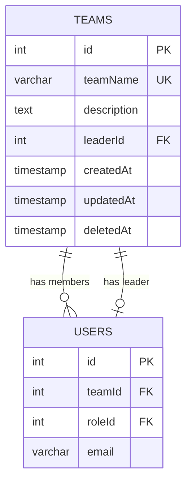
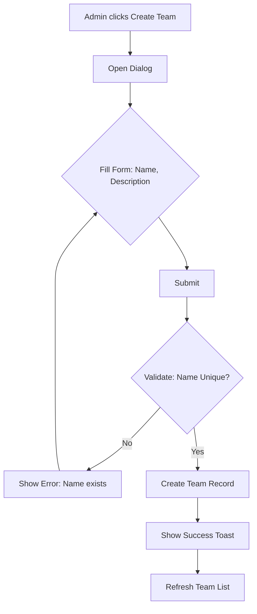
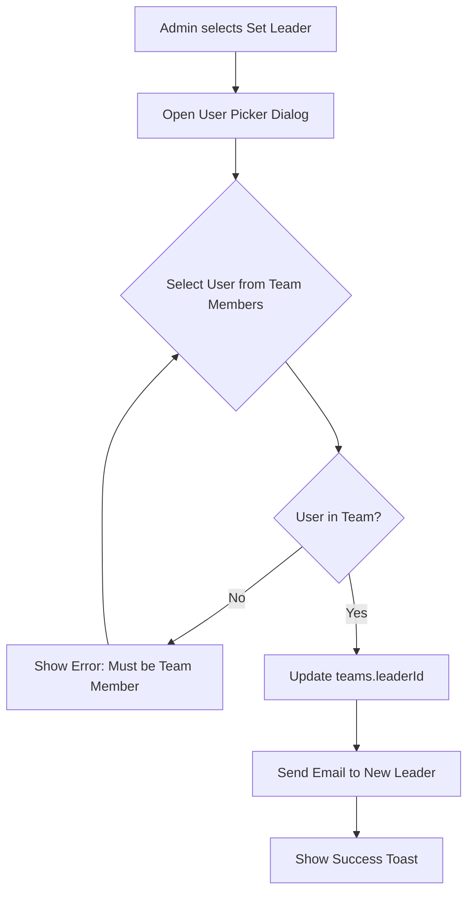
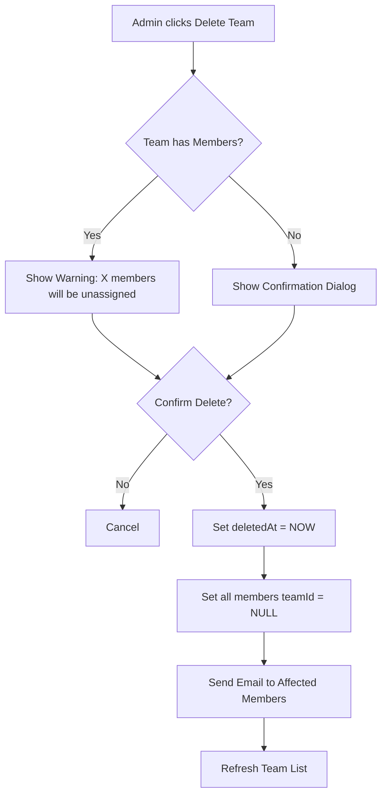
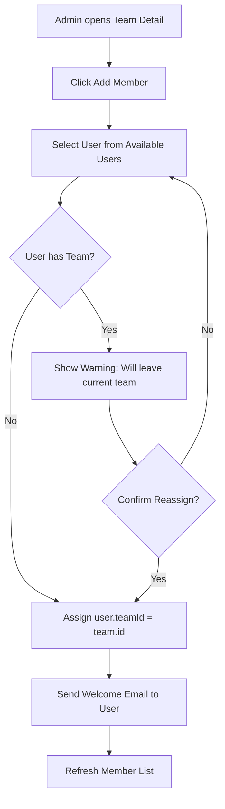

# Feature Specification: Team Management System

## 1. Executive Summary

The Team Management System allows Admin/HR to organize employees into teams, assign leaders, track team statistics, and manage team composition efficiently. This feature provides comprehensive CRUD operations, member assignment logic, analytics dashboard, email notifications, and export capabilities.

**Key Features:**

- ✅ Full CRUD for Teams (Create, Read, Update, Delete with soft-delete)
- ✅ Leader Assignment (must be a team member)
- ✅ Member Management (Add/Remove with auto-reassignment)
- ✅ Team Analytics Dashboard (Charts & Statistics)
- ✅ Email Notifications (Member added/removed)
- ✅ Excel/PDF Export for Team Lists

---

## 2. User Stories

### Admin / HR

**US-1: Create Team**

- As an Admin/HR, I want to create a new team with a name and description, so I can organize employees into groups.
- **AC:**
  - Team name is required and must be unique (case-insensitive)
  - Description is optional
  - Leader can be assigned later (initially NULL)
  - Success notification displayed

**US-2: View Team List**

- As an Admin/HR, I want to view all teams in a table with filters and search, so I can quickly find teams.
- **AC:**
  - Table shows: Team Name, Leader, Member Count, Created Date
  - Search by team name
  - Filter by: Has Leader, Active/Deleted
  - Pagination support
  - Responsive design (mobile card view)

**US-3: View Team Details**

- As an Admin/HR, I want to view detailed team information including members, statistics, and charts.
- **AC:**
  - Display: Team Name, Description, Leader, Member List
  - Show statistics: Total Members, Active Requests, Attendance Rate
  - Charts: Member distribution by role, Request trends
  - Quick actions: Edit Team, Delete Team, Manage Members

**US-4: Update Team**

- As an Admin/HR, I want to update team name, description, and leader.
- **AC:**
  - Team name must remain unique
  - Leader must be a current member of the team (or NULL)
  - Changes logged with timestamp
  - Success notification displayed

**US-5: Delete Team**

- As an Admin/HR, I want to delete a team (soft-delete).
- **AC:**
  - If team has members, auto-set their `teamId = NULL`
  - Show confirmation dialog with member count warning
  - Send email notifications to affected members
  - Team marked as deleted (`deletedAt` timestamp)

**US-6: Assign/Remove Members**

- As an Admin/HR, I want to add or remove members from a team.
- **AC:**
  - Add: Select from users without a team (or reassign from another team)
  - Remove: Set user's `teamId = NULL`
  - Email notification sent to user
  - Member count updated in real-time

**US-7: Assign Leader**

- As an Admin/HR, I want to assign or change the team leader.
- **AC:**
  - Leader must be an existing member of the team
  - If leader is removed from team, `leaderId` auto-set to NULL
  - Email notification sent to new/old leader
  - Validation error if selected user is not in team

**US-8: Export Team Data**

- As an Admin/HR, I want to export team lists and details to Excel/PDF.
- **AC:**
  - Export options: All Teams, Selected Team Details
  - Excel includes: Team Name, Leader, Members (with roles)
  - PDF includes team summary with statistics
  - Filename format: `Teams_Export_YYYYMMDD_HHMMSS`

**US-9: View Team Analytics**

- As an Admin/HR, I want to see team performance analytics and trends.
- **AC:**
  - Dashboard shows: Total Teams, Avg Team Size, Teams without Leader
  - Charts: Team Size Distribution, Request Approval Rate by Team
  - Date range filter for trend analysis

---

## 3. Database Design

### 3.1. Existing Schema (Already Defined)

```typescript
// ✅ teams table exists in schema.ts
export const teams = pgTable('teams', {
  id: serial('id').primaryKey(),
  teamName: varchar('team_name', { length: 100 }).notNull(),
  description: text('description'),
  leaderId: integer('leader_id'), // FK to users.id
  createdAt: timestamp('created_at').defaultNow(),
  updatedAt: timestamp('updated_at').defaultNow(),
  deletedAt: timestamp('deleted_at'), // Soft delete
})

// ✅ users.teamId already links to teams
users.teamId → teams.id
```

### 3.2. Schema Modifications (Optional Enhancement)

**Consider adding (if needed):**

```typescript
// Optional: Team metadata
teamCode: varchar('team_code', { length: 20 }).unique(), // e.g., "DEV-01", "QA-02"
department: varchar('department', { length: 100 }), // e.g., "Engineering", "Sales"
teamColor: varchar('team_color', { length: 7 }), // Hex color for UI visualization
maxMembers: integer('max_members'), // Team size limit
```

### 3.3. Data Integrity Rules

1. **Unique Team Name**: Case-insensitive unique constraint
2. **Leader Constraint**: `leaderId` must reference a user whose `teamId` matches the team's `id`
3. **Soft Delete**: `deletedAt IS NULL` for active teams
4. **Cascade Rules**:
   - Delete Team → Set all members' `teamId = NULL`
   - Remove Leader from Team → Set `leaderId = NULL`

### 3.4. Entity Relationship Diagram



---

## 4. Logic Flowchart

### 4.1. Create Team Flow



### 4.2. Assign Leader Flow



### 4.3. Delete Team Flow



### 4.4. Add Member to Team Flow



---

## 5. API / Server Functions

### 5.1. Team CRUD Operations

#### `createTeamFn`

```typescript
// Input
{
  teamName: string (required, 3-100 chars)
  description?: string
  leaderId?: number | null
}

// Logic
- Validate teamName unique (case-insensitive)
- If leaderId provided, verify user exists
- Create team record
- Return team object

// Output
{
  success: true,
  data: TeamResponse
}
```

#### `getTeamsFn`

```typescript
// Input
{
  page?: number
  limit?: number
  search?: string
  filterHasLeader?: boolean
  includeDeleted?: boolean
}

// Logic
- Query teams with joins to users (leader, members count)
- Apply filters and pagination
- Return teams with metadata

// Output
{
  data: Array<TeamWithStats>
  total: number
  page: number
}
```

#### `getTeamByIdFn`

```typescript
// Input
{ teamId: number }

// Logic
- Fetch team with leader details
- Join members with profiles
- Calculate statistics (member count, active requests)

// Output
{
  team: TeamDetails
  members: Array<UserWithProfile>
  stats: {
    totalMembers: number
    activeRequests: number
    avgAttendance: number
  }
}
```

#### `updateTeamFn`

```typescript
// Input
{
  teamId: number
  data: {
    teamName?: string
    description?: string
    leaderId?: number | null
  }
}

// Logic
- Validate teamName unique if changed
- If leaderId changed:
  - Verify new leader is team member
  - Send email to old/new leader
- Update team record
- Set updatedAt

// Output
{ success: true, data: TeamResponse }
```

#### `deleteTeamFn`

```typescript
// Input
{ teamId: number }

// Logic
- Get all team members
- Set deletedAt = NOW
- Update all members: teamId = NULL
- Send email notifications to members
- Return count of affected users

// Output
{
  success: true
  affectedMembers: number
}
```

### 5.2. Member Management

#### `addMemberToTeamFn`

```typescript
// Input
{
  teamId: number
  userId: number
}

// Logic
- Update user: teamId = teamId
- Send welcome email to user
- Return updated team member count

// Output
{ success: true, newMemberCount: number }
```

#### `removeMemberFromTeamFn`

```typescript
// Input
{
  teamId: number
  userId: number
}

// Logic
- Check if user is team leader
  - If yes: set teams.leaderId = NULL
- Update user: teamId = NULL
- Send notification email
- Return success

// Output
{ success: true }
```

#### `assignLeaderFn`

```typescript
// Input
{
  teamId: number
  leaderId: number | null
}

// Logic
- If leaderId not null:
  - Verify user.teamId = teamId
  - If not: return error
- Get old leader email
- Update teams.leaderId
- Send emails to old/new leader

// Output
{ success: true }
```

### 5.3. Analytics & Export

#### `getTeamAnalyticsFn`

```typescript
// Input
{
  startDate?: string
  endDate?: string
}

// Logic
- Calculate:
  - Total teams (active)
  - Avg team size
  - Teams without leader
  - Team size distribution (chart data)
  - Request approval rate by team

// Output
{
  totalTeams: number
  avgTeamSize: number
  teamsWithoutLeader: number
  teamSizeDistribution: Array<{ size: string, count: number }>
  requestApprovalRates: Array<{ teamName: string, rate: number }>
}
```

#### `exportTeamsToExcelFn`

```typescript
// Input
{
  teamIds?: Array<number> // If empty, export all
}

// Logic
- Query teams with members
- Generate Excel using xlsx library
- Format: Team Name | Leader | Members | Member Count
- Return file buffer

// Output
{ fileBuffer: Buffer, filename: string }
```

---

## 6. UI Components

### 6.1. Team Management Page (`/admin/teams`)

**Layout:**

```
├─ Breadcrumb: Home > Admin > Teams
├─ Header
│  ├─ Title: "Team Management"
│  └─ Actions: [+ Create Team] [Export Excel]
├─ Filters Bar
│  ├─ Search Input
│  ├─ Filter: Has Leader (Yes/No/All)
│  └─ Filter: Include Deleted
└─ Teams Table / Cards
   ├─ Columns: Name, Leader, Members, Created, Actions
   └─ Actions: [View] [Edit] [Delete]
```

**Components:**

- `TeamsTable` (Desktop view)
- `TeamCard` (Mobile responsive)
- `CreateTeamDialog`
- `EditTeamDialog`
- `DeleteTeamConfirmDialog`

### 6.2. Team Detail Page (`/admin/teams/:id`)

**Layout:**

```
├─ Team Header
│  ├─ Team Name + Edit Button
│  ├─ Description
│  └─ Stats Cards: [Total Members] [Active Requests] [Attendance]
├─ Leader Section
│  ├─ Current Leader Avatar + Name
│  └─ [Change Leader] Button
├─ Members Section
│  ├─ [+ Add Member] Button
│  └─ Members Table: Name, Role, Email, Actions [Remove]
└─ Analytics Charts
   ├─ Member Role Distribution (Pie Chart)
   └─ Request Trends (Line Chart)
```

**Components:**

- `TeamDetailHeader`
- `TeamStatsCards`
- `LeaderCard` with `AssignLeaderDialog`
- `TeamMembersTable` with `AddMemberDialog`, `RemoveMemberDialog`
- `TeamAnalyticsCharts` (using Recharts)

### 6.3. Team Analytics Dashboard (`/admin/teams/analytics`)

**Layout:**

```
├─ Date Range Picker
├─ Overview Cards
│  ├─ Total Teams
│  ├─ Avg Team Size
│  └─ Teams Without Leader
└─ Charts
   ├─ Team Size Distribution (Bar Chart)
   └─ Request Approval Rate by Team (Horizontal Bar)
```

**Components:**

- `DateRangePicker`
- `StatsCardGrid`
- `TeamSizeChart` (Bar Chart)
- `ApprovalRateChart` (Horizontal Bar)

### 6.4. Dialogs & Modals

**CreateTeamDialog**

```tsx
Fields:
- Team Name (required, max 100)
- Description (optional, textarea)
- Leader (optional, select from all users)

Validation:
- Unique team name
- If leader selected, must exist
```

**EditTeamDialog**

```tsx
Same as CreateTeamDialog but pre-filled
```

**AssignLeaderDialog**

```tsx
- Select from current team members only
- Show warning if changing existing leader
- Confirm action
```

**AddMemberDialog**

```tsx
- Search/Select user
- Show warning if user already in another team
- Confirm reassignment
```

**DeleteTeamConfirmDialog**

```tsx
- Show team name
- Display member count
- Warning text: "X members will be unassigned from this team"
- Confirm/Cancel buttons
```

---

## 7. Scheduled Tasks

**None required for this feature.**

_(Team management is event-driven, not time-based)_

---

## 8. Third-party Integrations

### 8.1. Charts (Recharts)

**Already in dependencies:** ✅ `"recharts": "2.15.4"`

**Usage:**

- `<PieChart>` for Member Role Distribution
- `<BarChart>` for Team Size Distribution
- `<LineChart>` for Request Trends

### 8.2. Excel Export (xlsx)

**Install:** `pnpm add xlsx`

**Usage:**

```typescript
import * as XLSX from 'xlsx'

const worksheet = XLSX.utils.json_to_sheet(teamData)
const workbook = XLSX.utils.book_new()
XLSX.utils.book_append_sheet(workbook, worksheet, 'Teams')
const buffer = XLSX.write(workbook, { bookType: 'xlsx', type: 'buffer' })
```

### 8.3. Email Notifications (Existing System)

**Leverage existing `emailTemplates` and `emailLogs`**

**New Templates Needed:**

1. `TEAM_MEMBER_ADDED`: "You've been added to {teamName}"
2. `TEAM_MEMBER_REMOVED`: "You've been removed from {teamName}"
3. `TEAM_LEADER_ASSIGNED`: "You're now the leader of {teamName}"
4. `TEAM_DELETED`: "Team {teamName} has been disbanded"

### 8.4. PDF Export (Optional - Future)

**Library:** `jsPDF` or server-side `Puppeteer`

**Usage:** Generate team roster PDFs with company branding

---

## 9. Hidden Requirements (AI Added)

### 9.1. Audit Trail

- **Requirement:** Log all team CRUD operations
- **Implementation:** Create `team_audit_logs` table
  ```typescript
  {
    ;(id,
      teamId,
      action(CREATED | UPDATED | DELETED),
      performedBy(userId),
      changeDetails(JSON),
      timestamp)
  }
  ```

### 9.2. Permission Checks

- **Requirement:** Only Admin/HR can manage teams
- **Implementation:** Server-side role validation in all team functions
  ```typescript
  if (!['ADMIN', 'HR'].includes(user.roleName)) {
    throw new Error('Insufficient permissions')
  }
  ```

### 9.3. Real-time UI Updates

- **Requirement:** When team changes, update member count live
- **Implementation:** Optimistic UI updates + refetch after mutation

### 9.4. Search Performance

- **Requirement:** Fast search even with 1000+ teams
- **Implementation:**
  - DB index on `teamName`
  - Server-side pagination
  - Debounced search input (300ms)

### 9.5. Email Queue

- **Requirement:** Handle bulk emails when deleting large teams
- **Implementation:** Queue emails async to avoid timeout
  ```typescript
  await Promise.all(members.map((m) => queueEmail(m.email, template)))
  ```

### 9.6. Validation Edge Cases

- **Scenario:** User is leader → Try to remove from team
- **Handling:** Auto-set `leaderId = NULL` first, then remove
- **Scenario:** Assign leader who just left team
- **Handling:** Check team membership in transaction

### 9.7. Mobile Responsiveness

- **Requirement:** Full functionality on mobile devices
- **Implementation:**
  - Table → Card layout on small screens
  - Touch-friendly buttons (min 44px hit area)
  - Swipe gestures for actions

### 9.8. Accessibility (A11y)

- **Requirement:** WCAG 2.1 AA compliance
- **Implementation:**
  - ARIA labels for all interactive elements
  - Keyboard navigation support
  - Screen reader announcements for dynamic updates

### 9.9. Error Recovery

- **Scenario:** Network failure during member assignment
- **Handling:** Show retry button, don't lose form state

### 9.10. Data Privacy

- **Requirement:** Only show teams user has permission to see
- **Implementation:** Leader role can only see their own team details

---

## 10. Tech Stack

### Frontend

- **Framework:** React 19 with TanStack Router
- **UI Library:** shadcn/ui + Radix UI
- **Styling:** Tailwind CSS v4
- **Forms:** React Hook Form + Zod validation
- **State:** Zustand (auth store)
- **Charts:** Recharts 2.15.4
- **Icons:** Tabler Icons React

### Backend

- **Runtime:** TanStack Start (SSR)
- **Database:** PostgreSQL
- **ORM:** Drizzle ORM
- **Validation:** Zod schemas
- **Email:** Existing email template system

### Build Tools

- **Bundler:** Vite
- **Package Manager:** pnpm
- **TypeScript:** v5.7

---

## 11. Build Checklist

### Phase 1: Database & Backend (3-4 hours)

- [ ] Review existing `teams` schema (already exists ✅)
- [ ] Create Zod schemas (`team.schemas.ts`)
  - [ ] `CreateTeamSchema`
  - [ ] `UpdateTeamSchema`
  - [ ] `AssignLeaderSchema`
  - [ ] `TeamResponseSchema`
- [ ] Implement server functions (`teams.server.ts`)
  - [ ] `createTeamFn`
  - [ ] `getTeamsFn` (with pagination)
  - [ ] `getTeamByIdFn`
  - [ ] `updateTeamFn`
  - [ ] `deleteTeamFn`
  - [ ] `addMemberToTeamFn`
  - [ ] `removeMemberFromTeamFn`
  - [ ] `assignLeaderFn`
  - [ ] `getTeamAnalyticsFn`
- [ ] Add email templates for team notifications
- [ ] Test all server functions

### Phase 2: Core UI Components (4-5 hours)

- [ ] Create `TeamsTable` component
  - [ ] Desktop table view
  - [ ] Mobile card view
  - [ ] Search & filters
  - [ ] Pagination
- [ ] Create `CreateTeamDialog`
  - [ ] Form with validation
  - [ ] Leader selection (optional)
- [ ] Create `EditTeamDialog`
- [ ] Create `DeleteTeamConfirmDialog`
  - [ ] Show member count warning
- [ ] Add Teams menu item to sidebar (Admin/HR only)
- [ ] Create `/admin/teams` route and page

### Phase 3: Team Detail Page (4-5 hours)

- [ ] Create `/admin/teams/:id` route
- [ ] Implement `TeamDetailHeader`
- [ ] Implement `TeamStatsCards`
  - [ ] Fetch and display statistics
- [ ] Implement `LeaderCard`
  - [ ] Show current leader
  - [ ] `AssignLeaderDialog` (filter to team members)
- [ ] Implement `TeamMembersTable`
  - [ ] List all members
  - [ ] `AddMemberDialog` (with reassignment warning)
  - [ ] `RemoveMemberDialog` (with confirmation)

### Phase 4: Analytics & Charts (3-4 hours)

- [ ] Install and configure Recharts (already installed ✅)
- [ ] Create `TeamAnalyticsCharts` component
  - [ ] Pie Chart: Member role distribution
  - [ ] Line Chart: Request trends
- [ ] Create `/admin/teams/analytics` page
  - [ ] Date range picker
  - [ ] Stats cards
  - [ ] Team size bar chart
  - [ ] Approval rate chart
- [ ] Implement `getTeamAnalyticsFn` backend

### Phase 5: Excel Export (2-3 hours) [Skipped]

- [-] Install `xlsx` package
- [-] Implement `exportTeamsToExcelFn`
  - [-] Generate Excel with team data
  - [-] Format columns properly
- [-] Add "Export" button to Teams page
- [-] Handle file download in browser

### Phase 6: Email Notifications (2-3 hours)

- [x] Create email templates
  - [x] `TEAM_MEMBER_ADDED`
  - [x] `TEAM_MEMBER_REMOVED`
  - [x] `TEAM_LEADER_ASSIGNED`
  - [x] `TEAM_DELETED`
- [x] Seed templates in database
- [x] Integrate email sending in:
  - [x] `addMemberToTeamFn`
  - [x] `removeMemberFromTeamFn`
  - [x] `assignLeaderFn`
  - [x] `deleteTeamFn`
- [x] Test email delivery

### Phase 7: Polish & Testing (2-3 hours)

- [x] Add loading states to all actions
- [x] Add error handling with toast notifications
- [x] Test responsive design (mobile/tablet/desktop)
- [x] Test edge cases:
  - [x] Delete team with members
  - [x] Assign leader not in team (should fail)
  - [x] Remove leader from team (auto-clear leaderId)
  - [x] Reassign member between teams
- [x] Add keyboard shortcuts (Cmd+K for search)
- [x] Add accessibility attributes (ARIA labels)
- [x] Optimize performance (debounce search, lazy load charts)

### Phase 8: Documentation (1 hour)

- [ ] Update API documentation
- [ ] Add inline code comments
- [ ] Create user guide for Team Management
- [ ] Update README with new features

---

## 12. Acceptance Criteria Summary

### ✅ Functional Requirements

1. Admin/HR can create teams with unique names
2. Teams can have 0 or 1 leader (must be team member)
3. Teams can have 0 to N members
4. Deleting a team auto-unassigns all members
5. Adding/removing members triggers email notifications
6. Leader assignment validates membership
7. Team list is searchable and filterable
8. Team details show statistics and charts
9. Analytics dashboard shows team trends
10. Excel export generates downloadable file

### ✅ Non-Functional Requirements

1. Response time < 500ms for team list load
2. Support up to 1000 teams with pagination
3. Mobile-responsive on all screens
4. WCAG 2.1 AA accessibility compliance
5. All mutations are transactional (rollback on error)
6. Email notifications queued for async processing
7. Soft-delete preserves data integrity

---

## 13. Future Enhancements (Out of Scope for v1)

1. **Team Calendar**: Shared team events and milestones
2. **Team Chat**: Built-in messaging for team members
3. **Team Goals & OKRs**: Track team objectives
4. **Team Budgets**: Financial tracking per team
5. **Multi-team Membership**: Allow users to belong to multiple teams
6. **Team Hierarchy**: Parent/child team relationships
7. **Team Templates**: Quick setup with predefined roles
8. **Slack Integration**: Sync teams with Slack channels

---

## 14. Risk Analysis

### High Risk

- **Data Consistency**: Ensure leader is always a team member
  - **Mitigation**: Database constraints + server validation
- **Email Overload**: Deleting large teams sends many emails
  - **Mitigation**: Queue emails, add rate limiting

### Medium Risk

- **Performance**: Large team lists may be slow
  - **Mitigation**: Pagination, indexing, caching
- **UX Complexity**: Too many dialogs confuse users
  - **Mitigation**: Clear labels, help tooltips

### Low Risk

- **Export Failure**: Excel generation timeout
  - **Mitigation**: Generate async, provide download link

---

## 15. Success Metrics

### KPIs to Track

1. **Adoption Rate**: % of employees assigned to teams within 30 days
2. **Leader Coverage**: % of teams with assigned leaders
3. **Avg Response Time**: API response time for team operations
4. **User Satisfaction**: NPS score from Admin/HR users
5. **Email Delivery Rate**: % of notifications successfully sent

---

**END OF SPECIFICATION**

---

**📌 NEXT STEPS:**

Anh xem qua Spec này, nếu OK thì gõ `/code` để em bắt đầu triển khai nhé! 🚀

Hoặc nếu cần chỉnh sửa gì, anh cứ nói, em sửa ngay!
