# Timesheet Management System - Technical Specification

**Version**: 1.0  
**Date**: January 19, 2026  
**Status**: Draft  
**Author**: Antigravity Product Architect

---

## 1. Executive Summary

### 1.1 Overview

The Timesheet Management System provides a visual calendar-based interface for tracking employee attendance, leave requests (Off/WFH), and work schedules. It aggregates approved requests from the existing Request Management module and displays them in an intuitive monthly grid view with statistics, charts, and export capabilities.

### 1.2 Key Features

- 📅 **Monthly Calendar Grid**: Visual representation of work days, off days, WFH days, and public holidays
- 📊 **Statistics Dashboard**: Summary cards and charts showing leave distribution
- 🔐 **Role-based Views**: Employee (self), Leader (team), Admin/HR (all)
- 📥 **Export**: Excel and PDF report generation
- 🎯 **Quick Actions**: Click-to-create new requests directly from calendar
- 🌐 **Public Holidays**: Auto-integration with Vietnam public holidays API

### 1.3 Success Metrics

- Reduce time to view team availability by 80%
- Enable instant leave balance visibility
- Facilitate better resource planning for leaders

---

## 2. User Stories

### 2.1 Employee Stories

```
US-TS-001: View Personal Timesheet
As an Employee,
I want to view my monthly timesheet in a calendar format,
So that I can quickly see my work schedule and leave days.

Acceptance Criteria:
- Calendar displays current month by default
- My approved Off/WFH requests are color-coded
- Public holidays are highlighted
- I can navigate to previous/next months
- Summary stats show my leave balance
```

```
US-TS-002: Create Request from Calendar
As an Employee,
I want to click on a calendar date to create a new leave request,
So that I can quickly submit requests without navigating to another page.

Acceptance Criteria:
- Clicking a future date opens request creation dialog
- Date is pre-filled in the form
- Cannot create requests for past dates
- Cannot create requests for dates with existing approved requests
```

### 2.2 Leader Stories

```
US-TS-003: View Team Timesheet
As a Team Leader,
I want to view my team members' timesheets,
So that I can plan work assignments and identify coverage gaps.

Acceptance Criteria:
- Can filter by team member
- Can view multiple members' calendars simultaneously (optional)
- Can see pending requests with different styling
- Can export team timesheet report
```

### 2.3 Admin/HR Stories

```
US-TS-004: Organization-wide Timesheet
As an HR Admin,
I want to view timesheets across all teams,
So that I can generate payroll reports and analyze leave patterns.

Acceptance Criteria:
- Can filter by team, department, or individual
- Can export comprehensive Excel report
- Can view aggregated statistics (total WFH days, leave trends)
- Can generate PDF reports for archival
```

---

## 3. Database Design

### 3.1 Existing Schema (No Changes Required)

```sql
-- Already exists from Request Management
CREATE TABLE requests (
  id SERIAL PRIMARY KEY,
  user_id INTEGER REFERENCES users(id),
  type VARCHAR(10) CHECK (type IN ('OFF', 'WFH')),
  start_date DATE NOT NULL,
  end_date DATE NOT NULL,
  reason TEXT,
  status VARCHAR(20) DEFAULT 'PENDING',
  approved_by INTEGER REFERENCES users(id),
  approved_at TIMESTAMP,
  created_at TIMESTAMP DEFAULT NOW(),
  deleted_at TIMESTAMP
);
```

### 3.2 New Table: Public Holidays (Optional - Can use API instead)

```sql
CREATE TABLE public_holidays (
  id SERIAL PRIMARY KEY,
  date DATE NOT NULL UNIQUE,
  name VARCHAR(255) NOT NULL,
  country VARCHAR(2) DEFAULT 'VN',
  is_recurring BOOLEAN DEFAULT FALSE,
  created_at TIMESTAMP DEFAULT NOW()
);

-- Indexes
CREATE INDEX idx_public_holidays_date ON public_holidays(date);
CREATE INDEX idx_public_holidays_country ON public_holidays(country);
```

### 3.3 Sample Public Holidays Data (Vietnam 2026)

```sql
INSERT INTO public_holidays (date, name, country) VALUES
  ('2026-01-01', 'New Year''s Day', 'VN'),
  ('2026-01-28', 'Tết Holiday (Day 1)', 'VN'),
  ('2026-01-29', 'Tết Holiday (Day 2)', 'VN'),
  ('2026-01-30', 'Tết Holiday (Day 3)', 'VN'),
  ('2026-04-30', 'Reunification Day', 'VN'),
  ('2026-05-01', 'International Labor Day', 'VN'),
  ('2026-09-02', 'National Day', 'VN');
```

---

## 4. Logic Flow

### 4.1 Data Fetching Flow


### 4.2 Calendar Cell Rendering Logic

```mermaid
graph TD
    A[For Each Day in Month] --> B{Is Public Holiday?}
    B -->|Yes| C[Mark as Holiday]
    B -->|No| D{Has Approved Request?}

    D -->|Yes - OFF| E[Color: Orange, Icon: 🌴]
    D -->|Yes - WFH| F[Color: Blue, Icon: 🏠]
    D -->|No| G{Is Weekend?}

    G -->|Yes| H[Gray Background]
    G -->|No| I[White Background - Working Day]

    C --> J[Gray Background, Icon: 🎉]
```



### 4.3 Export Flow


---

## 5. API Contract

### 5.1 Get Timesheet Data

```typescript
/**
 * Fetch timesheet data for a specific month
 */
export const getTimesheetDataFn = createServerFn({ method: 'POST' }).handler(
  async (ctx) => {
    const schema = z.object({
      token: z.string(),
      params: z.object({
        userId: z.number().optional(), // If not provided, use current user
        month: z.number().min(1).max(12),
        year: z.number().min(2020).max(2100),
      }),
    })

    // Returns:
    return {
      success: true,
      data: {
        requests: [
          {
            id: 1,
            userId: 5,
            type: 'OFF',
            startDate: '2026-01-15',
            endDate: '2026-01-17',
            reason: 'Family vacation',
            status: 'APPROVED',
            user: { fullName: 'John Doe', avatar: '...' },
          },
        ],
        publicHolidays: [{ date: '2026-01-01', name: 'New Year' }],
        stats: {
          totalWorkingDays: 22,
          totalOffDays: 3,
          totalWfhDays: 2,
          totalPublicHolidays: 1,
          leaveBalance: {
            annual: 12, // Days remaining
            sick: 5,
            used: 3,
          },
        },
      },
    }
  },
)
```

### 5.2 Get Team Timesheet (Leader)

```typescript
export const getTeamTimesheetFn = createServerFn({ method: 'POST' }).handler(
  async (ctx) => {
    // Verify leader role
    // Fetch all team members' requests
    // Return aggregated data
  },
)
```

### 5.3 Export Timesheet

```typescript
export const exportTimesheetFn = createServerFn({ method: 'POST' }).handler(
  async (ctx) => {
    const schema = z.object({
      token: z.string(),
      params: z.object({
        format: z.enum(['EXCEL', 'PDF']),
        month: z.number(),
        year: z.number(),
        userId: z.number().optional(),
      }),
    })

    // Generate file
    // Return download URL or base64
  },
)
```

### 5.4 Get Public Holidays

```typescript
export const getPublicHolidaysFn = createServerFn({ method: 'POST' }).handler(
  async (ctx) => {
    // Option 1: Fetch from DB
    // Option 2: Call external API (https://date.nager.at/api/v3/PublicHolidays/2026/VN)
    // Cache for 1 year
  },
)
```

---

## 6. UI Components

### 6.1 Component Hierarchy

```
<TimesheetPage>
  ├── <TimesheetHeader>
  │   ├── <MonthYearPicker>
  │   ├── <UserFilter> (Leader/Admin only)
  │   └── <ExportButton>
  │
  ├── <TimesheetStats>
  │   ├── <StatCard title="WFH Days" value={3} />
  │   ├── <StatCard title="Off Days" value={2} />
  │   ├── <StatCard title="Working Days" value={20} />
  │   └── <LeaveBalanceCard />
  │
  ├── <TimesheetChart>
  │   └── <PieChart data={leaveDistribution} />
  │
  ├── <TimesheetCalendar>
  │   ├── <CalendarHeader> (Mon-Sun)
  │   └── <CalendarGrid>
  │       └── <DayCell> × 35-42
  │           ├── dayNumber
  │           ├── requestBadge (if exists)
  │           ├── holidayIndicator
  │           └── onClick → CreateRequestDialog
  │
  └── <TimesheetLegend>
      ├── 🏠 WFH
      ├── 🌴 Annual Leave
      ├── 🤒 Sick Leave
      └── 🎉 Public Holiday
```

### 6.2 DayCell Component Spec

```typescript
interface DayCellProps {
  date: Date
  isCurrentMonth: boolean
  isToday: boolean
  isWeekend: boolean
  isPublicHoliday: boolean
  request?: {
    type: 'OFF' | 'WFH'
    status: 'PENDING' | 'APPROVED' | 'REJECTED'
    reason: string
  }
  onClick: (date: Date) => void
}

// Visual States:
// - Current month: opacity 100%
// - Other month: opacity 40%
// - Today: border highlight
// - Weekend: gray background
// - Public Holiday: yellow background + 🎉
// - OFF (Approved): orange background + 🌴
// - WFH (Approved): blue background + 🏠
// - Pending: dashed border
```

### 6.3 Color Palette

```css
:root {
  --timesheet-working: #ffffff;
  --timesheet-weekend: #f5f5f5;
  --timesheet-holiday: #fff9e6;
  --timesheet-off: #ffe5cc;
  --timesheet-wfh: #cce5ff;
  --timesheet-pending: #f0f0f0;
  --timesheet-today-border: #3b82f6;
}
```

---

## 7. Scheduled Tasks

### 7.1 Monthly Timesheet Email Report

```typescript
// Cron: 0 9 1 * * (9 AM on 1st of every month)
async function sendMonthlyTimesheetReport() {
  // For each employee:
  // 1. Generate previous month's timesheet
  // 2. Calculate leave balance
  // 3. Send email with PDF attachment
}
```

### 7.2 Public Holidays Sync

```typescript
// Cron: 0 0 1 1 * (Midnight on Jan 1st every year)
async function syncPublicHolidays() {
  // Fetch next year's holidays from API
  // Insert into public_holidays table
  // Cache for performance
}
```

---

## 8. Third-party Integrations

### 8.1 Public Holidays API

- **Provider**: [Nager.Date](https://date.nager.at/)
- **Endpoint**: `GET https://date.nager.at/api/v3/PublicHolidays/{year}/VN`
- **Caching**: 1 year (refresh annually)
- **Fallback**: Local DB table if API fails

### 8.2 Chart Library

- **Library**: `recharts` (already in project)
- **Charts**:
  - Pie Chart: Leave type distribution
  - Bar Chart: Monthly leave trends (optional)

### 8.3 Export Libraries

- **Excel**: `xlsx` (SheetJS)
  - Generate `.xlsx` file with calendar grid
  - Include summary sheet with stats
- **PDF**: `jsPDF` + `html2canvas`
  - Render calendar as image
  - Add header with company logo
  - Include stats table

---

## 9. Hidden Requirements (AI-Added)

### 9.1 Performance Optimization

- **Lazy Loading**: Only fetch data for visible month
- **Caching**: Cache public holidays in localStorage
- **Debouncing**: Month navigation debounced by 300ms

### 9.2 Accessibility (A11y)

- **Keyboard Navigation**: Arrow keys to navigate calendar
- **Screen Reader**: Announce day details on focus
- **ARIA Labels**: Proper labeling for all interactive elements

### 9.3 Error Handling

- **API Failure**: Show cached data with warning banner
- **Export Failure**: Retry mechanism + user notification
- **Invalid Date**: Prevent navigation to invalid months

### 9.4 Mobile Responsiveness

- **Desktop (>768px)**: Full calendar grid (7 columns)
- **Mobile (<768px)**: Compact view (single column list)
- **Touch**: Swipe left/right to change months

### 9.5 Data Validation

- **Date Range**: Cannot create overlapping requests
- **Weekend Requests**: Warn if selecting weekend (allow but warn)
- **Holiday Requests**: Inform user if selecting public holiday

### 9.6 Audit Trail

- **Export Logs**: Track who exported what and when
- **View Logs**: Track timesheet access (for compliance)

---

## 10. Tech Stack

### 10.1 Frontend

- **Framework**: React 19 + TanStack Router
- **Calendar**: Custom implementation with `date-fns`
- **Charts**: `recharts`
- **Export**: `xlsx`, `jsPDF`, `html2canvas`
- **UI**: shadcn/ui components + Tailwind CSS

### 10.2 Backend

- **Server Functions**: TanStack Start
- **ORM**: Drizzle ORM
- **Database**: PostgreSQL
- **Validation**: Zod

### 10.3 External APIs

- **Public Holidays**: Nager.Date API

---

## 11. Build Checklist

### Phase 1: Backend (Day 1-2)

- [ ] Create `public_holidays` table (optional)
- [ ] Implement `getTimesheetDataFn`
- [ ] Implement `getTeamTimesheetFn` (Leader)
- [ ] Implement `getPublicHolidaysFn` with API integration
- [ ] Add Zod schemas for validation
- [ ] Write unit tests for date calculations

### Phase 2: Core UI (Day 3-4)

- [ ] Create `<TimesheetCalendar>` component
- [ ] Create `<DayCell>` component with all states
- [ ] Implement month navigation
- [ ] Add color-coded request display
- [ ] Integrate public holidays display
- [ ] Add click-to-create request functionality

### Phase 3: Stats & Charts (Day 5)

- [ ] Create `<TimesheetStats>` component
- [ ] Implement leave balance calculation
- [ ] Add Pie Chart for leave distribution
- [ ] Create `<TimesheetLegend>` component

### Phase 4: Filters & Permissions (Day 6)

- [ ] Add User Filter (Leader/Admin)
- [ ] Implement role-based data fetching
- [ ] Add loading states and skeletons
- [ ] Error handling and fallbacks

### Phase 5: Export (Day 7)

- [ ] Implement Excel export
- [ ] Implement PDF export
- [ ] Add download progress indicator
- [ ] Test export with large datasets

### Phase 6: Polish & Testing (Day 8)

- [ ] Mobile responsive design
- [ ] Accessibility audit
- [ ] Performance optimization
- [ ] E2E testing
- [ ] Documentation

---

## 12. Open Questions & Decisions

### 12.1 Resolved

✅ **Q**: Display format?  
**A**: Month view with calendar grid

✅ **Q**: Export formats?  
**A**: Excel and PDF

✅ **Q**: Public holidays?  
**A**: Yes, integrate with API

### 12.2 Pending

⏳ **Q**: Should we show pending requests on calendar?  
**Suggestion**: Yes, with dashed border to differentiate from approved

⏳ **Q**: Multi-user calendar view (like Google Calendar)?  
**Suggestion**: Phase 2 feature, start with single user view

⏳ **Q**: Timezone handling for international teams?  
**Suggestion**: Use UTC, display in user's local timezone

---

## 13. Success Criteria

### 13.1 Functional

- ✅ Calendar displays all approved requests correctly
- ✅ Public holidays are highlighted
- ✅ Stats match actual data
- ✅ Export generates valid Excel/PDF files
- ✅ Click-to-create opens request dialog

### 13.2 Non-Functional

- ✅ Page loads in < 2 seconds
- ✅ Calendar renders smoothly (60 FPS)
- ✅ Mobile-friendly (responsive)
- ✅ Accessible (WCAG 2.1 AA)

---

**End of Specification**

**Next Steps**: Review this spec, then run `/code` to begin implementation! 🚀
